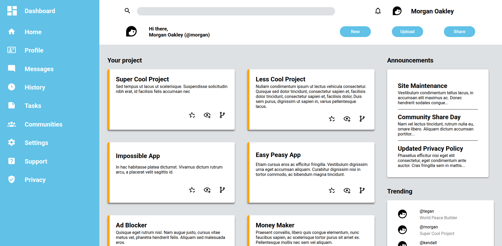

# admin-dashboard

# Link

- [Live-preview](https://azanra.github.io/admin-dashboard/)
- [Assignment-page](https://www.theodinproject.com/lessons/node-path-intermediate-html-and-css-admin-dashboard)

# About

This project is about using mainly grid to recreate
the design as closely as possible by nesting element
container to become grid container. There are some case
where i use flexbox where i want to the item to control
the layout instead, like header profile icon.

# Review

There are lot of duplicated css declaration that can be
grouped together instead of creating new one.

# Scrennshot

